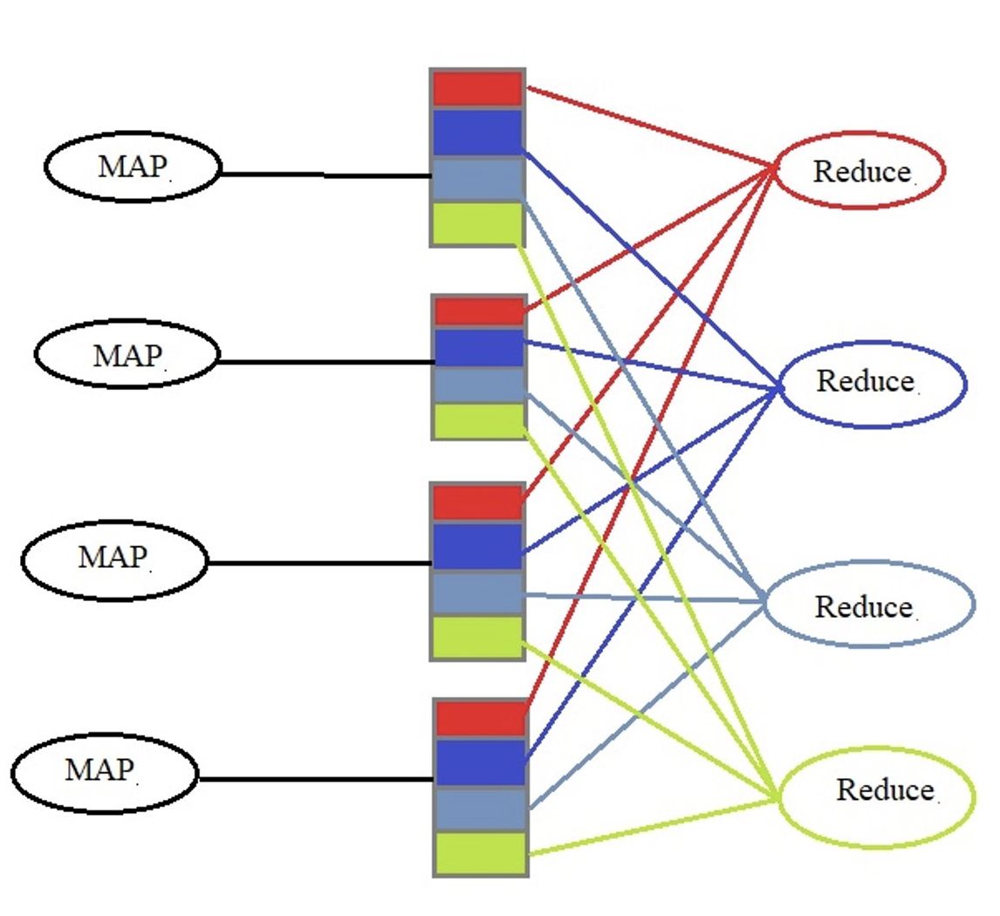
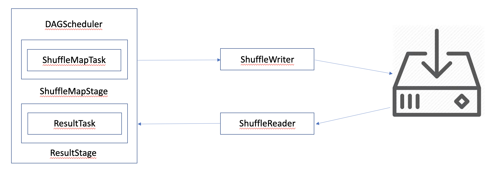
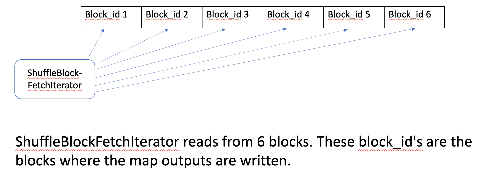
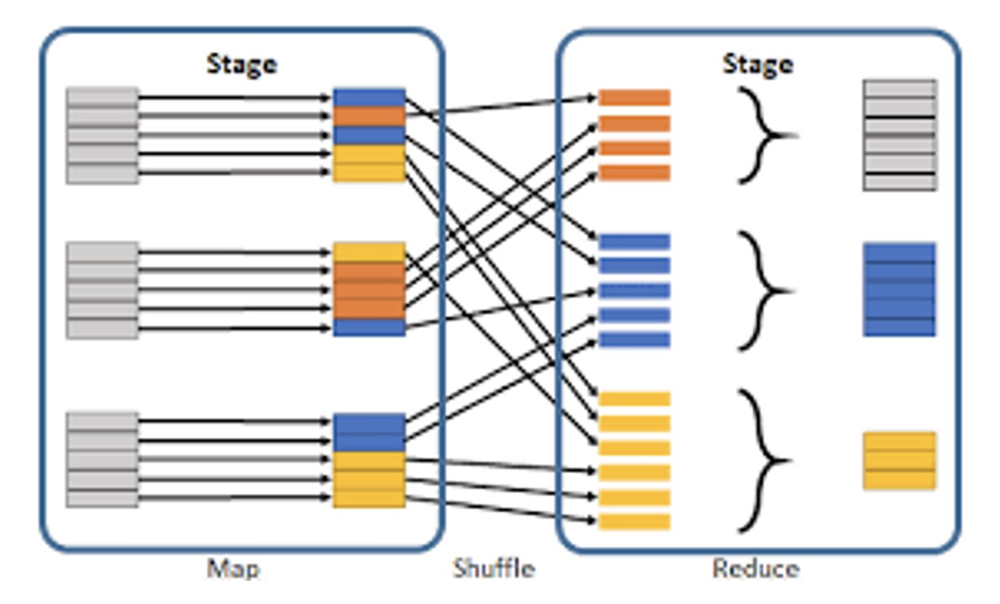
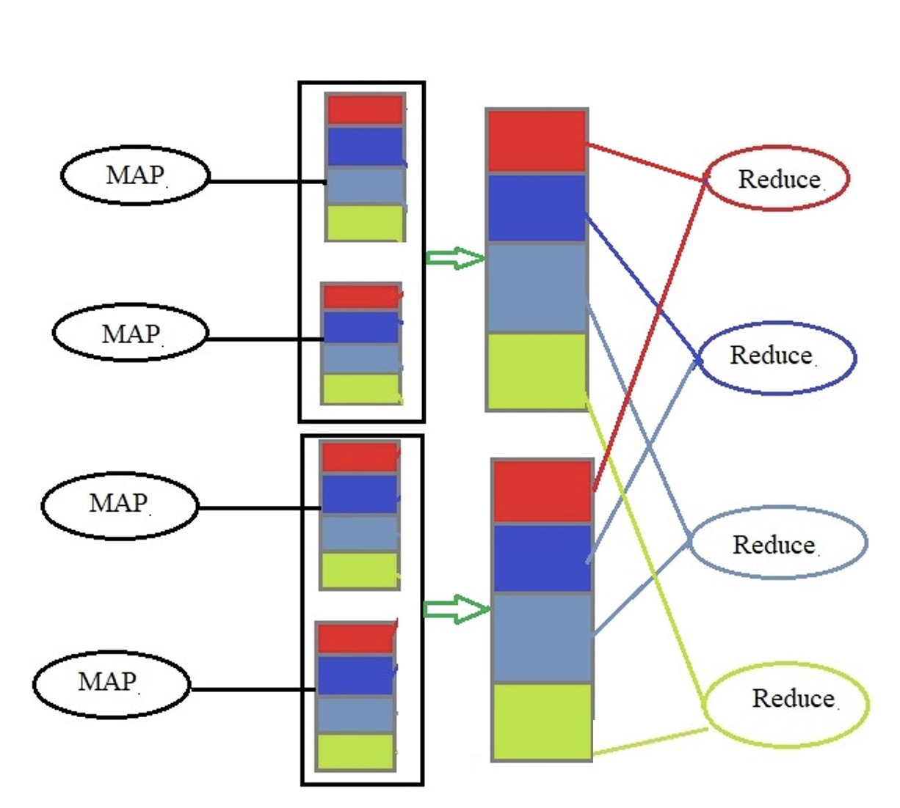
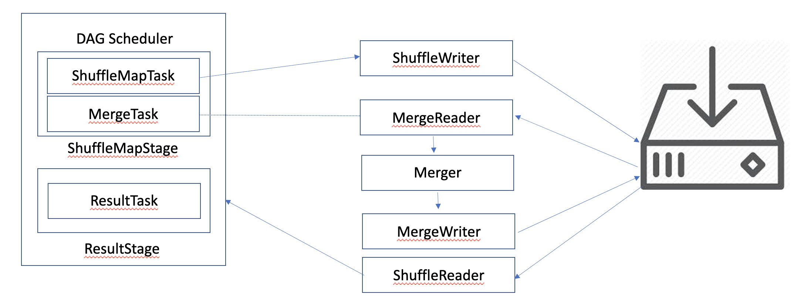
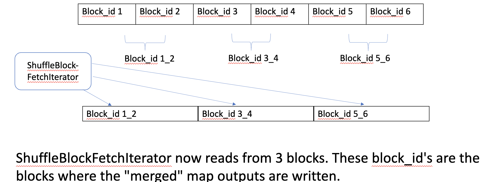
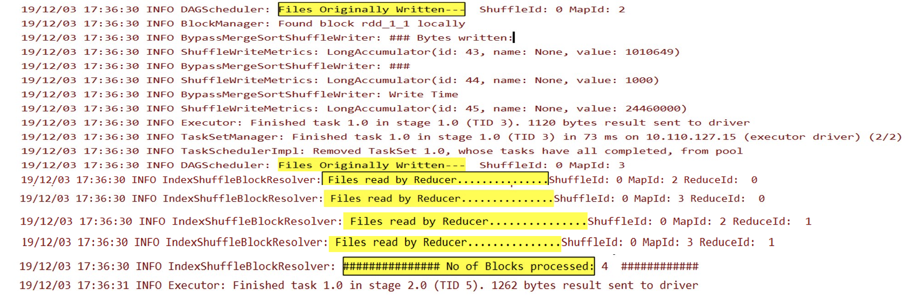
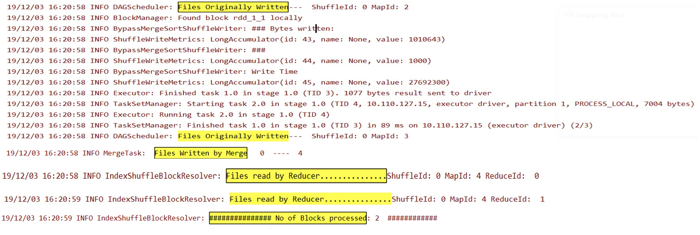
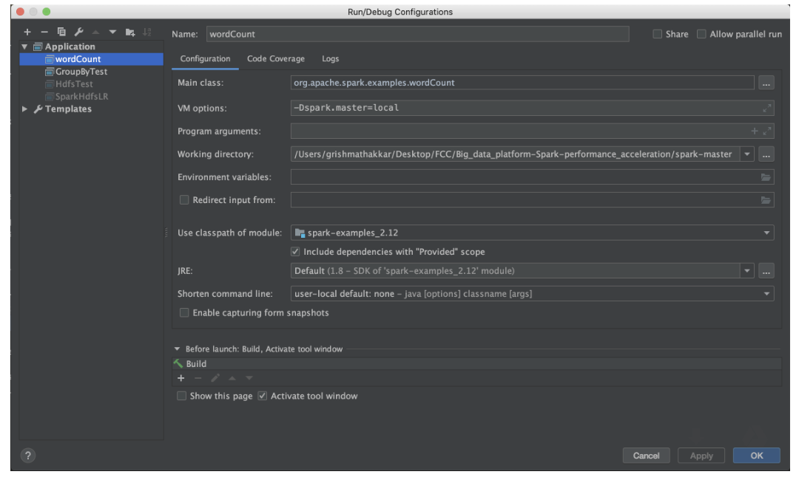

** **
# Big data platform (Spark) performance acceleration

## 1. Vision and Goals Of The Project: 

Shuffling could become the scaling bottleneck when running many small tasks in multistage data analysis jobs. In certain circumstances, data is too large to fit into memory, intermediate data has to keep on disks, which makes a large amount of small random I/O requests significantly slow down the performance of spark.

Optimize the partitioning and shuffle algorithms in Spark, to perform more efficient I/O and shuffling. There is believed to be a significant opportunity for improvement in changing the I/O patterns so that large data files are read more efficiently from disk.

* Improve the efficiency of the Spark shuffle phase, better than vanilla spark.
* Decrease the number of I/O operations for the reduce phase.
* Implement the N-way merge in the shuffle phase for improving efficiency.
* Analyze, using different metrics, the performance improvement over vanilla spark.

## 2. Users/Personas Of The Project
People developing Spark applications.

## 3. Scope and Features Of The Project:
### Scope:
* Provide a design architecture of Riffle proposed in the riffle paper.
* Analyze and understand the existing code of spark, especially that of the shuffle phase.
* Provide a detailed analysis based on metrics (speed-up, difference in number of disk i/o operations) to compare the performances of the job run before and after riffle implementation.

## 4. Solution Concept

**Aggregate:** This starts aggregation once N map outputs are generated.

### Current Implementation: ###
The current implementation of spark has three phases: Map, shuffle and reduce. Reduce phase requires all the map outputs to start its computation. Once all map outputs are shuffled, the reduce phase fetches this as input to start its processing. The processing can often scale well by splitting jobs into smaller tasks for better parallelism.

**Vanilla Spark**

Consider there are 4 mappers are producing 4 partitions with 4 blocks in each partition. Different colors represent different blocks of data in different partitions. Each reducer has to read from its color associated-block. So the red colored reducer has to read from red blocks, therefore, overall it has 4 random reads, one for each partitions. Similarly, blue, lemon green, and grayish blue reducers make 4 random reads each. Therefore, there are a total of 16 random reads in the traditional vanilla spark implementation.

**Orignal Flow Diagram**

1. DAG Scheduler: The high-level scheduling layer that implements stage-oriented scheduling. It computes a DAG of stages for each job, keeps track of which RDDs and stage outputs are materialized, and finds a minimal schedule to run the job. 
2. ShuffleMapStage: As explained before.
3. ShuffleMapTask: A ShuffleMapTask divides the elements of an RDD into multiple buckets
4. ResultStage: As explained before.
5. ResultTask: A task that sends back the output to the driver application.
6. ShuffleWriter: Write the map outputs to the disk.
7. ShuffleReader: Reads the shuffled and sorted result. 

**Block reading in Orignal flow**

### Observation: ###

**Different stages of Spark**

Stages is a set of parallel tasks that have to be executed.
There are two primary stages in the shuffle implementation:
1. ShuffleMapStage: Intermediate stage that exists between the map and shuffle phase that saves the map output files that are later fetched by reduce tasks. 
2. ResultStage: The final stage in spark that computes the result. 

 All-to-all data transfer, Shuffle Operations become the scaling bottleneck when running many small tasks in multi-stage data analytics jobs. The key observation is that this bottleneck is due to the superlinear increase in disk I/O operations as data volume increases. This is due to the fact that the number of shuffle I/O requests between map and reduce stages grows quadratically as the number of tasks grows, and the average size per request actually shrinks linearly.

### Improvements proposed: ###

**Proposed implementation for N-Way merge by Riffle Paper**

Image demonstrates the new N-way merge implementation.
The only difference here is that we’ve merged N-block (here n=2) to form a bigger partition. Therefore, now, the red reducer has to only make two random reads instead of four, and this is consistent across other reducers. Therefore, there are a total of 8 random reads

**Updated Flow Diagram**

1. DAG Scheduler: As explained above
2. ShuffleMapStage: As explained before
3. ShuffleMapTask: As explained before
4. MergeTask: Does the actual Merging of map outputs. 
5. ShuffleWriter: As explained above
6. MergeReader: Reads the map outputs
7. Merger: Merges the map outputs
8. MergeWriter: Writes the merged outputs to the Disk
9. ShuffleReader: Reads from the disk in the ResultTask. 

**Block reading in updated flow**

As per the riffle paper, adding an N-Way merger to the shuffle phase helps improve efficiency by merging small intermediate  shuffle map outputs files into larger blocks. We will merge the map outputs as soon as the “N” outputs are generated. Hence, number of I/O operations gets reduced to M/N from M, where M denotes the number of Map outputs and N denotes the factor “N” in the N-Way merge

 Here are some reference we are using at the moment to work on the solution:
 
https://haoyuzhang.org/publications/riffle-eurosys18.pdf

## 5. Acceptance criteria

* Implement Riffle’s N-Way merge algorithm.
* Prove a decrease in the number of I/O operations by the reduce phase.

## Results:
**Vanilla Spark Implementation Result:**

No. Mappers(M) = 2​

    No. Reducers(R) = 2​

    No. Of I/O operations on ​

    reduce phase: ​

    (M x R) : 2 x 2 = 4

**N-way Merge Implementation Result:**

No. Mappers(M) = 2​

    No. Reducers(R) = 2​

    N factor: 2​

    No. Of I/O​

    operations on reduce​

    phase: ​(M x R)/N : (2 x 2)/2 = 2​

This reduces the the number of random I/O operations by the reduce phase.

NOTE: Reads and write for the merge are all sequential, hence they do not add too much to overhead of I/o operations.

## 6. Release Planning
### Tasks: ###

* Setting up the Spark Environment (latest version)
* Learn more about Spark Architecture(Map, shuffle and Reduce phase).
* Finding an appropriate dataset/project to perform analysis.
* Analyze and understand the existing spark code and rest API, especially for the spark shuffle phase.
* Run Spark applications and profile Spark performance before and after riffle implementation.
* Providing detailed analysis based on metrics(the difference in number of I/O operations).

### Timeline: ###

**16th September - 29th September:** 

Setup environment, find the existing spark code, read and summarize riffle paper, learn thoroughly about the spark architecture and their phases: map, shuffle and reduce

Presentation Link: https://1drv.ms/p/s!Aj2G3numQP0utHXYOnMyJf1dvMkP

**30th September - 13th October:**

Understand existing spark code for the shuffle phase, complete the design architecture of Riffle, discuss ideas on how to start the implementation of N-Way merge, and find the appropriate data set.

Presentation Link: https://1drv.ms/p/s!Aj2G3numQP0utHidtUcEnSf759UO 

Paper Presentation Link: https://1drv.ms/p/s!Aj2G3numQP0utHotq5uGxGZmb2EV

**14th October - 27th October:**

Work on the backlog, start strategizing and designing for implementation of N-Way merge. 
Presentation Link: https://1drv.ms/p/s!Aj2G3numQP0utHziF9GZFdaXCy_h

**28th October - 10th November:**

Start the implementation using a new approach, but limit it to 1:1 mapping and merge in the next sprint. 
Presentation Link: https://1drv.ms/p/s!Aj2G3numQP0utQGpueCx88jb73_i

**11th November - 24th November:**
Realizing the flaw in our previous implementation, we came up with a new approach and started implementing this for 1:1 mapping. 
Presentation Link: https://1drv.ms/p/s!Aj2G3numQP0utQP9S0yfT6hds_E7

**25th November - 8th December:**

Make a final presentation, work on N:1 mapping, and also implement the merge algorithm.
Presentation Link: https://1drv.ms/p/s!Aj2G3numQP0utQb35_c1nmmsdk2X

## Set-up:
Instructions to set up are as follows:
1. Download IntelliJ (https://www.jetbrains.com/idea/download/#section=mac)
2. Install the Scala Plug-in (https://www.jetbrains.com/help/idea/discover-intellij-idea-for-scala.html)
3. Clone the repository and import project as Maven project, select relevant profiles and let IntelliJ index the files. 
4. Run "./build/mvn -DskipTests clean package" on the terminal
5. For debugging - Click on Edit configuration and update VM options and checkmark the include dependencies with "Provided" scope. 

### Youtube Video Presentation :
https://youtu.be/wKv_xyW-Wuw

### Final Presentation:
https://1drv.ms/p/s!Aj2G3numQP0utQb35_c1nmmsdk2X

## Contributors:
1. Grishma Atul Thakkar
2. Virat Goradia
3. Nipun Midha
4. Baoshu Brady Qi
** **
